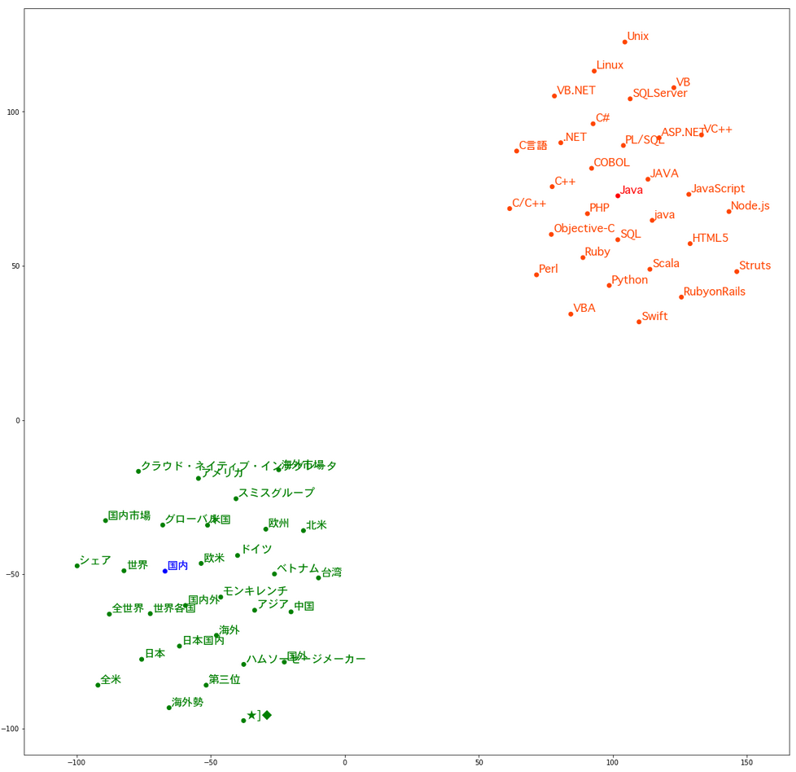
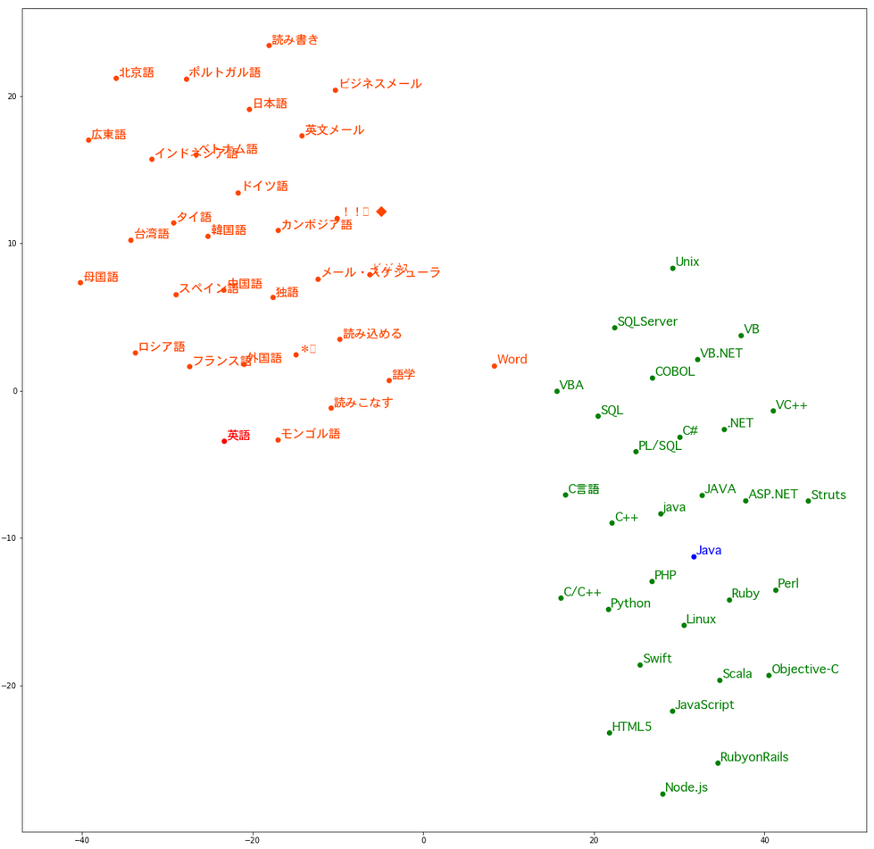
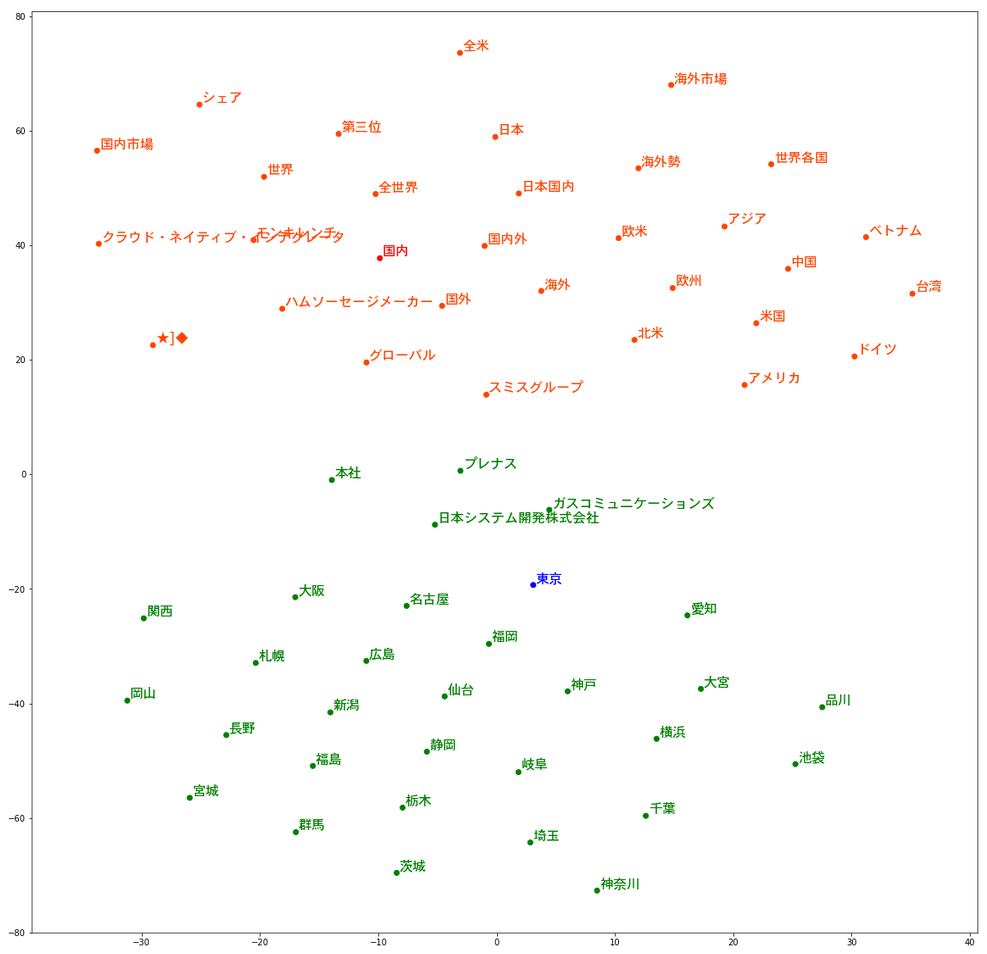
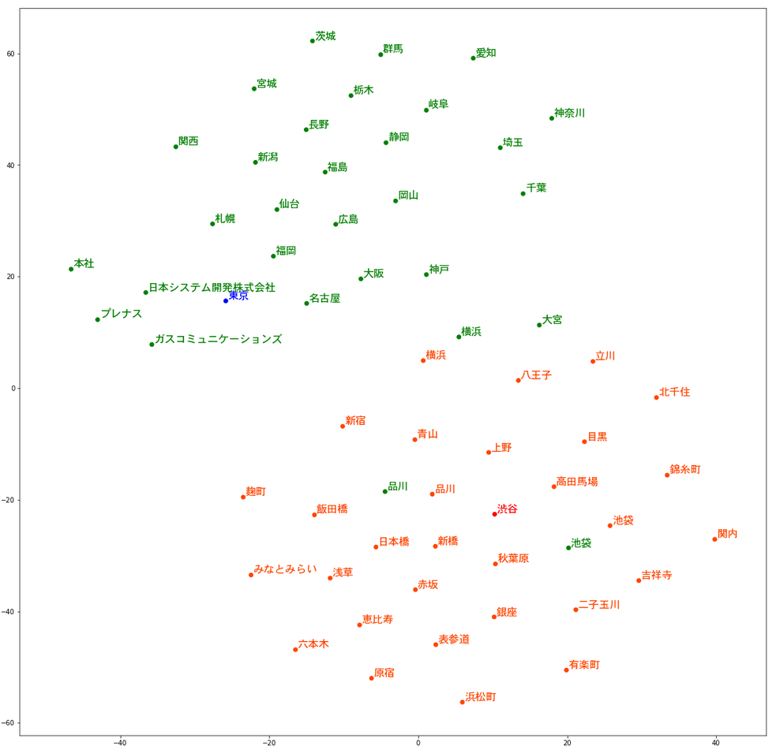
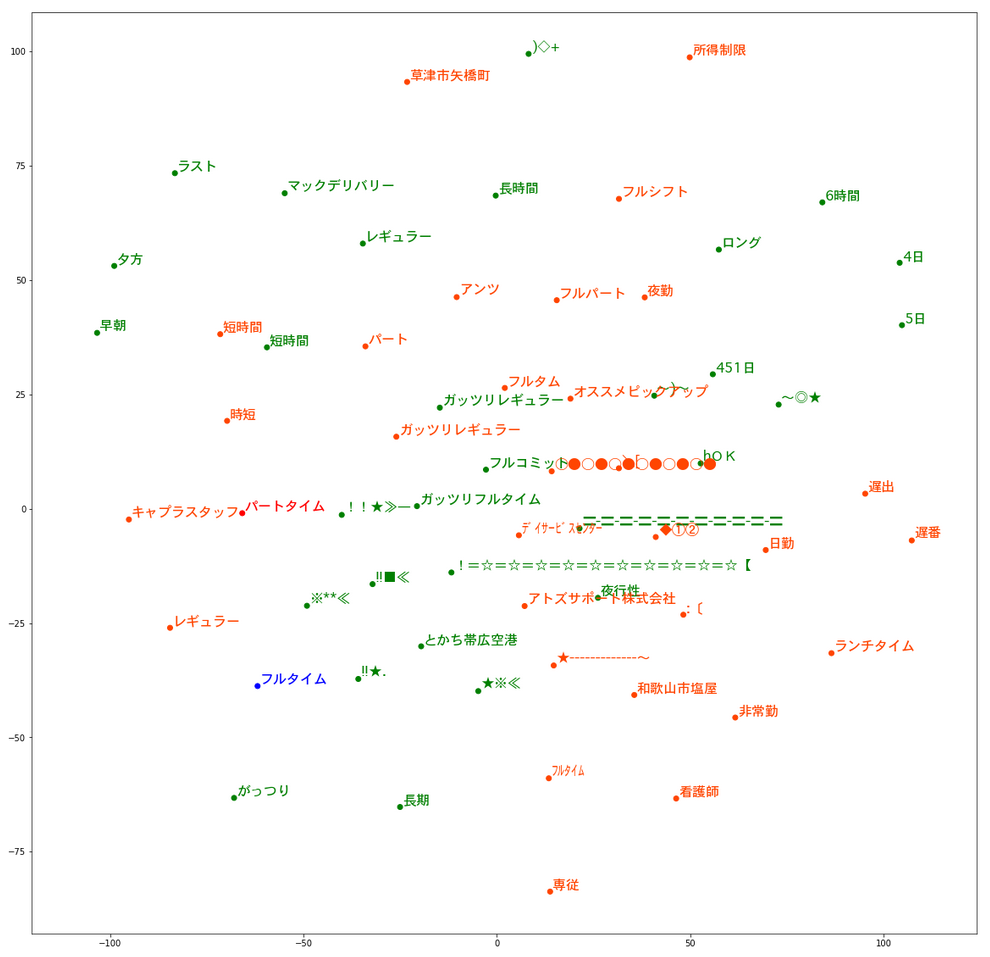

# HR領域の単語ベクトル

# 目次

1.  [概要](#summary)
2.  [ダウンロード](#download)
3.  [単語ベクトルの使い方](#usage)

# 概要

「HR領域のワードベクトル」は、株式会社ビズリーチが提供する求人検索エンジン「スタンバイ」の求人データの一部を用いて学習したワードベクトルです。 
word2vecの手法で生成した100次元、200次元のデータセットを提供します。

## 単語ベクトル

* 学習求人情報数: 2,769,416
* 学習単語数: 約9.95億
* 単語ベクトル数： 173,134
* データフォーマット： Cバイナリフォーマット（gensim）

## 学習パラメータ

* 学習モデル: skip-gram
* 単語分割： MeCab
* 辞書: mecab-ipadic-neologd
* ベクトルサイズ(size): 100/200
* 反復回数(-iter): 15
* 単語最低出現回数(min_count): 10
* 文脈長(window): 2
* 負例サンプリング (negative): 5

## ダウンロード

*   [100次元のワードベクトル](https://github.com/bizreach/ai/releases/download/2018-03-13/stanby-jobs-100d-word2vector.bin)
*   [200次元のワードベクトル](https://github.com/bizreach/ai/releases/download/2018-03-13/stanby-jobs-200d-word2vector.bin)

### ライセンス

本データは、 Public Domain Dedication and License v1.0 に基づき利用することが出来ます。  
規約の全文は下記のURLからご確認ください。  
[Public Domain Dedication and License v1.0 http://www.opendatacommons.org/licenses/pddl/1.0/](https://opendatacommons.org/licenses/pddl/1.0/)

## 単語ベクトルの使い方

### ワードベクターデータの読込み

    from gensim.models import KeyedVectors
    

    MODEL_FILENAME = "models/stanby-jobs-100d-word2vector.bin"
    w2v = KeyedVectors.load_word2vec_format(MODEL_FILENAME, binary=True)
    

### ワードのベクターを取得

    vec = w2v['Java']
    # ベクターの空間数
    vec.shape
    # ベクターの値を表示
    print(str(vec)[:98]+'...')
    

    
     [-0.44223538  0.59743136 -0.44677502 -0.20310995  0.37675732  0.92682654  -0.06886505 -0.20521739 ...]
    

### もっとも似ているワード（トップ５）を取得

    w2v.most_similar('Java', topn=5)
    

    [('PHP', 0.9712682962417603),
     ('JAVA', 0.9526373147964478),
     ('C#', 0.9488359689712524),
     ('Ruby', 0.9369792342185974),
     ('.NET', 0.9361046552658081)]

### 単語ベクトル同士の演算

    w2v.most_similar(positive=['ベンチャー企業', '金融'], negative=['大手企業'], topn=1)
    

    [('フィンテック', 0.6884675025939941)]

### 類似ワード取得

    # プログラミング言語名: `Java` ともっとも似ているワード
    w2v.most_similar('Java', topn=10)
    

    [('PHP', 0.9712682962417603),
     ('JAVA', 0.9526373147964478),
     ('C#', 0.9488359689712524),
     ('Ruby', 0.9369792342185974),
     ('.NET', 0.9361046552658081),
     ('ASP.NET', 0.9313936829566956),
     ('java', 0.9227190017700195),
     ('C++', 0.9223655462265015),
     ('COBOL', 0.9184844493865967),
     ('VB.NET', 0.9088617563247681)]

    
    # 会社名: `IBM` ともっとも似ているワード
    w2v.most_similar('IBM', topn=10)
    

    [('Microsoft', 0.811033308506012),
     ('VMware', 0.7976212501525879),
     ('Oracle', 0.7942770719528198),
     ('オラクル', 0.7839919328689575),
     ('Salesforce', 0.7832513451576233),
     ('SAP', 0.7779339551925659),
     ('ERP', 0.7710530161857605),
     ('EBS', 0.7645050287246704),
     ('VMWare', 0.7632642984390259),
     ('Systemi', 0.7618693113327026)]

    
    # OS名: `Windows` ともっとも似ているワード
    w2v.most_similar('Windows', topn=10)
    

    [('Linux', 0.9160923361778259),
     ('UNIX', 0.8995077610015869),
     ('OS', 0.888439953327179),
     ('WindowsServer', 0.8751233816146851),
     ('Unix', 0.8610063791275024),
     ('WindowsPC', 0.8528259992599487),
     ('AIX', 0.8442054986953735),
     ('windows', 0.8413159847259521),
     ('Server', 0.838931143283844),
     ('LINUX', 0.8363751173019409)]

    
    # データベース名: `MySQL` ともっとも似ているワード
    w2v.most_similar('MySQL', topn=10)

    [('PostgreSQL', 0.9566069841384888),
     ('MongoDB', 0.9117156267166138),
     ('Eclipse', 0.901472806930542),
     ('SQLServer', 0.9006097316741943),
     ('DB2', 0.8929930329322815),
     ('Oracle', 0.8813129663467407),
     ('Apache', 0.8784164190292358),
     ('nginx', 0.8717295527458191),
     ('SQL', 0.8711268901824951),
     ('Laravel', 0.87052321434021)]

    
    # 自然言語名: `英語` ともっとも似ているワード
    w2v.most_similar('英語', topn=10)

    [('韓国語', 0.7218669056892395),
     ('中国語', 0.7218181490898132),
     ('外国語', 0.6808233261108398),
     ('ドイツ語', 0.6776742339134216),
     ('タイ語', 0.6728017330169678),
     ('＊«', 0.6656531095504761),
     ('日本語', 0.6635153293609619),
     ('ベトナム語', 0.6520404815673828),
     ('スペイン語', 0.647976279258728),
     ('台湾語', 0.6467177867889404)]

    
    # 都市名: `東京` ともっとも似ているワード
    w2v.most_similar('東京', topn=10)
    

    [('大阪', 0.8046212792396545),
     ('福岡', 0.801379919052124),
     ('名古屋', 0.7855145931243896),
     ('横浜', 0.7834505438804626),
     ('神奈川', 0.7795026302337646),
     ('仙台', 0.7674016356468201),
     ('埼玉', 0.765630841255188),
     ('群馬', 0.7605865597724915),
     ('千葉', 0.7604857087135315),
     ('神戸', 0.7413618564605713)]

    
    # 地域名: `国内` ともっとも似ているワード
    w2v.most_similar('国内', topn=10)
    

    [('国内外', 0.813056468963623),
     ('国外', 0.7807206511497498),
     ('海外', 0.7761911749839783),
     ('日本国内', 0.7164636850357056),
     ('欧米', 0.7147268056869507),
     ('アメリカ', 0.6754658222198486),
     ('米国', 0.6720942258834839),
     ('欧州', 0.6683015823364258),
     ('シェア', 0.6552318334579468),
     ('国内市場', 0.6519010066986084)]

### 表示

    draw_2d_2groups(w2v, '国内', 'Java', topn=30)
    

    ['国内', '国内外', '国外', '海外', '日本国内', '欧米', 'アメリカ', '米国', '欧州', 'シェア', '国内市場', '全世界', 'アジア', 'モンキレンチ', '中国', '世界各国', 'グローバル', '世界', '★]◆', 'スミスグループ', 'ドイツ', 'ハムソーセージメーカー', '海外市場', '北米', '全米', '海外勢', '第三位', '台湾', '日本', 'クラウド・ネイティブ・インテグレータ', 'ベトナム']
    ['Java', 'PHP', 'JAVA', 'C#', 'Ruby', '.NET', 'ASP.NET', 'java', 'C++', 'COBOL', 'VB.NET', 'Objective-C', 'PL/SQL', 'Perl', 'JavaScript', 'Swift', 'VB', 'Scala', 'VC++', 'Python', 'Linux', 'C/C++', 'SQL', 'RubyonRails', 'SQLServer', 'C言語', 'Struts', 'Node.js', 'Unix', 'HTML5', 'VBA']
    

    draw_2d_2groups(w2v, 'Java', '英語', topn=30)
    

    ['Java', 'PHP', 'JAVA', 'C#', 'Ruby', '.NET', 'ASP.NET', 'java', 'C++', 'COBOL', 'VB.NET', 'Objective-C', 'PL/SQL', 'Perl', 'JavaScript', 'Swift', 'VB', 'Scala', 'VC++', 'Python', 'Linux', 'C/C++', 'SQL', 'RubyonRails', 'SQLServer', 'C言語', 'Struts', 'Node.js', 'Unix', 'HTML5', 'VBA']
    ['英語', '韓国語', '中国語', '外国語', 'ドイツ語', 'タイ語', '＊«', '日本語', 'ベトナム語', 'スペイン語', '台湾語', 'ロシア語', 'ﾋﾞｼﾞﾈｽ', '北京語', 'フランス語', 'カンボジア語', 'インドネシア語', 'ポルトガル語', '語学', '英文メール', 'ビジネスメール', '読み込める', 'メール・スケジューラ', 'モンゴル語', '読みこなす', '独語', '！！»◆', '読み書き', 'Word', '母国語', '広東語']
    

    draw_2d_2groups(w2v, '東京', '国内', topn=30)
    

    ['東京', '大阪', '福岡', '名古屋', '横浜', '神奈川', '仙台', '埼玉', '群馬', '千葉', '神戸', '宮城', '愛知', '新潟', '広島', '栃木', '札幌', '静岡', '長野', 'プレナス', '本社', '茨城', '岡山', '日本システム開発株式会社', '品川', '大宮', '関西', 'ガスコミュニケーションズ', '岐阜', '福島', '池袋']
    ['国内', '国内外', '国外', '海外', '日本国内', '欧米', 'アメリカ', '米国', '欧州', 'シェア', '国内市場', '全世界', 'アジア', 'モンキレンチ', '中国', '世界各国', 'グローバル', '世界', '★]◆', 'スミスグループ', 'ドイツ', 'ハムソーセージメーカー', '海外市場', '北米', '全米', '海外勢', '第三位', '台湾', '日本', 'クラウド・ネイティブ・インテグレータ', 'ベトナム']
    

    draw_2d_2groups(w2v, '東京', '渋谷', topn=30)
    

    ['東京', '大阪', '福岡', '名古屋', '横浜', '神奈川', '仙台', '埼玉', '群馬', '千葉', '神戸', '宮城', '愛知', '新潟', '広島', '栃木', '札幌', '静岡', '長野', 'プレナス', '本社', '茨城', '岡山', '日本システム開発株式会社', '品川', '大宮', '関西', 'ガスコミュニケーションズ', '岐阜', '福島', '池袋']
    ['渋谷', '池袋', '品川', '上野', '銀座', '二子玉川', '吉祥寺', '秋葉原', '新橋', '新宿', '日本橋', '六本木', '有楽町', '赤坂', '目黒', '北千住', '表参道', '高田馬場', '青山', '横浜', '錦糸町', '関内', 'みなとみらい', '原宿', '麹町', '飯田橋', '浜松町', '八王子', '恵比寿', '立川', '浅草']
    

    draw_2d_2groups(w2v, 'フルタイム', 'パートタイム', topn=30)
    

    ['フルタイム', '短時間', 'レギュラー', 'ガッツリフルタイム', 'とかち帯広空港', '！！★≫―', 'hＯＫ', '早朝', '夕方', '※**≪', '〓-〓-〓-〓-〓-〓-〓-〓-〓-〓-〓', '4日', '★※≪', '～)～', 'ガッツリレギュラー', '長期', '6時間', '!!■≪', '5日', '夜行性', 'フルコミット', 'ラスト', '！＝☆＝☆＝☆＝☆＝☆＝☆＝☆＝☆＝☆＝☆【', 'マックデリバリー', '長時間', 'がっつり', 'ロング', '451日', '～◎★', '!!★.', ')◇+']
    ['パートタイム', 'フルタム', '所得制限', 'レギュラー', 'キャプラスタッフ', 'パート', '時短', '非常勤', '遅番', 'ﾌﾙﾀｲﾑ', 'ランチタイム', 'オススメピックアップ', '専従', '◆①②', 'アトズサポート株式会社', 'ﾃﾞｲｻｰﾋﾞｽｾﾝﾀｰ', '夜勤', '短時間', '草津市矢橋町', '日勤', 'ガッツリレギュラー', 'フルパート', '★-------------～', ':〔', 'アンツ', '和歌山市塩屋', '遅出', 'フルシフト', '○●○●○●○●○●○●', '看護師', '＼[']
    

